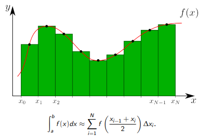

**Numerical integration methods**

Numerical integration is the calculation of the approximate value of a certain integral.

The simplest methods of numerical integration:

1) Rectangle method (middle, left, right)
2) Trapezoid method
3) Simpson's method

**Rectangle method**

The essence of the method of medium rectangles is shown in the figure:

Other rectangle methods work in a similar way

|Left rectangle method|The right rectangle method|
| :-: | :-: |
|||

**Trapezoid method**

More accurate results can be obtained if you replace rectangles with trapezoids:

In this case, the value of a certain integral will be equal to the sum of the areas of all trapezoids in a given interval.

**Progress of the work**

1. Write a program that implements the methods of middle rectangles, left rectangles, right rectangles.

As the function under study, take:

1) Linear
2) Power
3) Trigonometric
4) …

For ease of use inside the program, arrange them in separate functions, for example:

def f1(x):
    return x + x \*\* 3 \* cos(x)

2. Select the integration interval and calculate analytically the corresponding definite integrals.
3. Select the integration step and calculate the integrals using the program. Create a table (see the next page) and enter the received values into it. Conduct several experiments with different integration steps.
4. Determine the absolute and relative errors for each function and for each method. Make a conclusion.
5. At what ratio of integration steps will the rectangle method give approximately the same accuracy as the trapezoid method?
6. Give recommendations on the choice of the integration step (or the number of partition segments) when using one of the methods.
7. Does the type of function depend on the accuracy of the method at the same integration step?
8. You can independently study, implement and investigate the Simpson method.

   
4. It follows from the calculations that the smallest error (absolute and relative) was obtained using the method of average rectangles and the trapezoid method. Therefore, these methods are more accurate than the others.

5. The error of different methods depends on the type of function – so for a straight line and a sine wave, the error is less for the methods of middle rectangles and trapezoids, and for a parabola – for left and right rectangles. Also, the effectiveness of the methods depends on the step of the function and for a sufficiently small step, the trapezoid method is the most accurate. Therefore, to answer this question, you need to do a lot of research, changing the type of function and the integration step, to find some average value. I have conducted several experiments, analyzed and believe that the ratio of steps should be on the order of 0.1.

6. The rectangle method. The smaller the step we choose, the smaller the error will be at one step. And, consequently, the entire error will be smaller (since the errors of all steps are summed up).

7. Yes, it depends. It can be seen from the measurements given in the table. The reason for this is that it is much easier to integrate some functions than other complex ones. For example, a straight line and a hyperbola.
